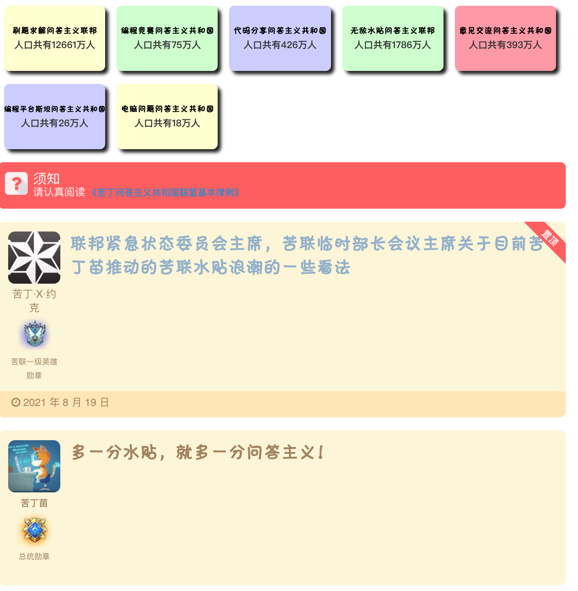

# 

2021黏8岳19囸

## <strong>突发新闻</strong>

就在今天，苦丁·X·约克，第三十二届苦联部长会议主席，联合驻守在无敌水贴的驻军发动政变，成立紧急状态委员会，组建新的部长会议（33届部长会议，临时部长会议），软禁了苦丁苗总统，相关消息我们将持续跟踪报道。

以下是苦联公报消息：

## 代分民众推动逗比互兑，砖家认为有利有弊

> 导读：最近，由苦丁苗推动的“论坛的问答主义”导致苦联经济混乱，紧急状态委员会管理不善，代分民众推动的“豆币互兑”运动如火如荼，同时苦丁币价值正不断缩水，“豆币互兑”是否会刺激问答的经济？下面由专家来回答。

就目前来说，豆币互兑理论上会遏制苦丁币那边的币值缩水，增强联系，稳定问答经济，但也有可能，产生黑洞效应，可能会导致更严重的缩水，同时代分民众普遍较为富裕，他们的动机也是值得商榷的。

## 反水贴运动带来不便，怨声载道

最近推行的反水贴运动限制过多，以至于连普通民众都加入到了“去**，还图片”的浪潮中，目前支持者无数，相关消息我们将持续跟踪报道。
