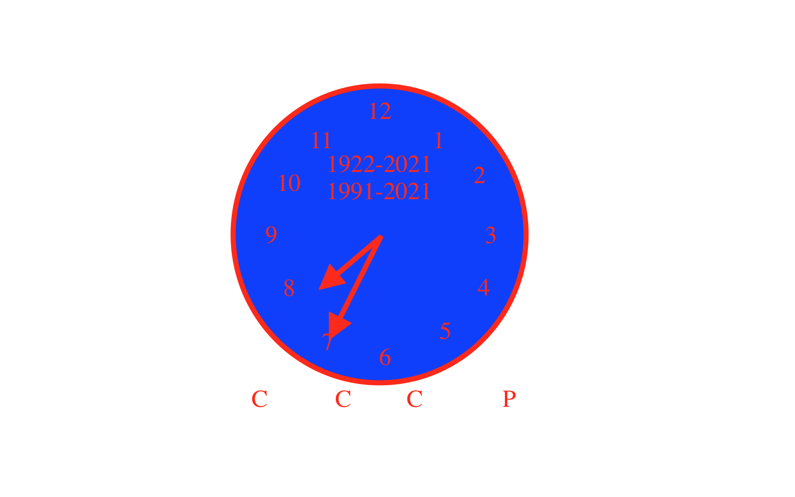
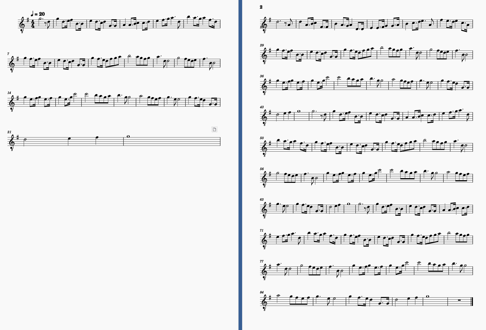

# 

2021黏12岳25囸

## 苏联解体30周年·立国99周年特刊

> 导读：1991年12月21日，苏维埃俄罗斯等15个苏联加盟共和国宣告脱离苏联，25日19：35，苏联总统辞职，26日苏联停止存在。下面是某位人士的**前**苏联国歌的歌词改编版：

歌词：

*“牢不可破的联盟，自由共和国”*

*“伟大的罗斯将屹立不倒！”*

*“万岁，依靠人民意志而建立起的”*

*“统一的，强大的苏维埃联盟！”*

*“自由的祖国，我们的荣耀，”*

*“各民族的友爱筑成坚固堡垒！”*

*“苏维埃红旗，人民的红旗，”*

*“把我们从胜利引向胜利！”*

*九十九载已过去，再睁眼一看，*

*联盟已不见，美元在飘扬！*

*看看，依靠鹰酱意志而建立起的*

*统一的，“强大”的996帝国！*

*联盟在哪里？它已在地府，*

*然而地上的人们在积蓄着力量，*

*当时机一到，当时机已到，*

*我们将从胜利走向胜利！*

*三十整载已过去，再睁眼一看，*

*鹰酱多劫难，五十侯烟起！*

*看看，靠鹰酱建立的“伟大”帝国，*

*一场场浩劫，撕下其画皮！*

*联盟在哪里？它已在地府，*

*然而地上的人们在积蓄着力量，*

*当时机一到，当时机已到，*

*我们将从胜利走向胜利！*